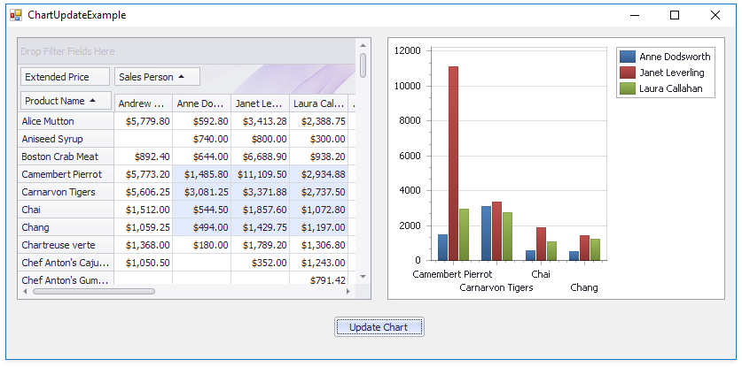

<!-- default badges list -->

<!-- default badges end -->
<!-- default file list -->
*Files to look at*:

* [Form1.cs](./CS/ChartUpdateExample/Form1.cs) (VB: [Form1.vb](./VB/ChartUpdateExample/Form1.vb))
<!-- default file list end -->
# How to Pass the PivoGridControl's Data to a Chart

A chart bound to a pivot is redrawn frequently and may result in a slow application performance. This example demonstrates how to update the chart on demand.

To manually update the chart, copy the PivotGridControl's data to the IList data source and bind the ChartControl to that intermediate data source.

